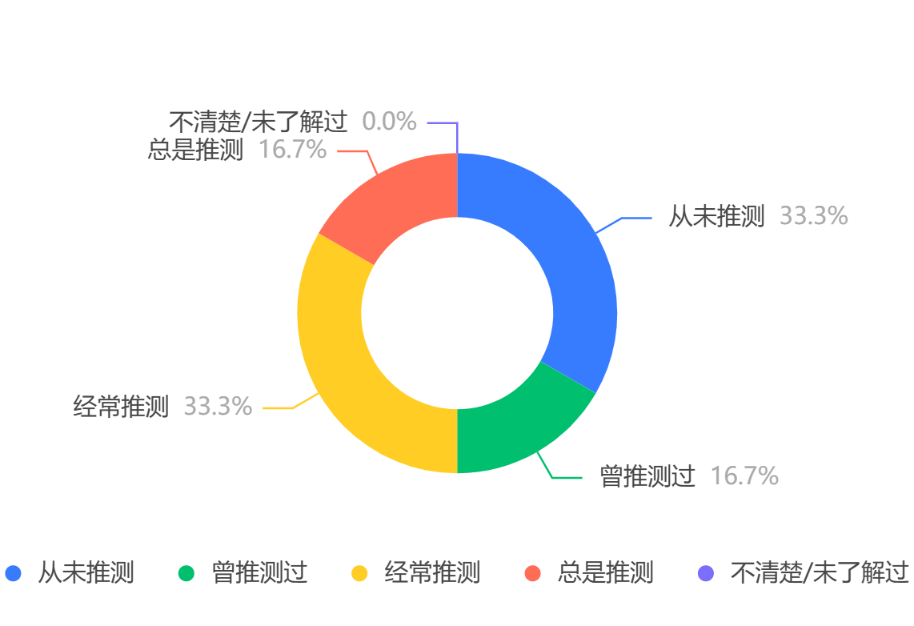

<h1>策划案第3版</h1>
[TOC]

name 

School of Intelligent Systems Engineering, Sun Yat-sen University

<h2>软件构想与立项</h2>

#### 项目名称——红潮日记（Crimson Diary）
结合了经期的红色象征和日记的个人记录，暗示这是一个专注于女性经期记录和个人经历的应用。

结合了红色象征与日记的陪伴记录功能，表明本款软件专注于女性经期记录和伴侣的陪伴记录功能。

#### 项目目的
月经是女性的一种正常生理现象，在两性相处的过程中，女性经期的多种生理心理变化是值得关注的周期性现象，但是男性普遍存在对月经的不同时期不够了解、月经的周期时长不够明了等情况。向男性用户普及月经相关知识、并鼓励在伴侣生理期期间进行记录，理解伴侣的情绪波动和生理不适。

本项目可以帮助用户记录月经信息，并为其提供相关的健康状况提醒。

##### 本产品旨在向男性用户普及月经知识，理解月经这一生理现象，让用户能够更加便捷、科学地关爱伴侣。

#### 性质
本产品的性质为非赢利导向的，以完成课程任务为基础的微信小程序产品。在小程序搭建过程中会参考学习现有的项目代码。

#### 定位
本产品的定位为微信小程序，目标用户群体主要为希望了解月经知识，进一步理解伴侣的男性。

<h2>用户需求分析与产品定位修改</h2>

分析方法：问卷调查分析，线上访谈分析、竞品分析

#### 问卷调查分析

我们基于初始的项目设想发布了第一次问卷，但是得到的问卷数量并不理想。

在初始的问卷收集结果中，绝大多数女性调查者对经期记录软件的态度为从未接触或不会使用，在正常的身体状况下仅凭推测便可以得知大概的月经周期。

    
     
    
部分问卷结果展示

#### 线上访谈分析

通过与女性调查者进行线上访谈，我们发现：

1. 会使用月经记录软件的女性多为注重审美与身体健康的年轻女性，我们小组开发的相关软件很难满足她们审美层面的需求。

2. 由于小组成员均为男性，无法从开发层面与设计角度提供女性视角，很容易导致误解或难以预料的结果。

3. 在月经期间获得伴的理解与陪伴也为用户诉求之一。

#### 竞品分析

通过对比市面上相关的关注于女性经期的应用软件：

fomometer、柠檬小月、她扶等
- **fomometer**:
  - 应用功能分析：
    - fomometer主要分为五大模块（UI中清晰的将五大模块置于页面底部）
    - `今日`模块：点击进入今日模块，滑动选择日期，记录某天的相关信息
      - 记录信息包括：经期详情、性生活、身体状态及描述、个人情绪、白带状况、出血情况（出血量，出血颜色）、体重等（用户可以自定义记录的模块）
    - `日历`模块：直观地将经期、易孕期、排卵日、经期预测期用不同地颜色展示在日历上
      - 模块还可将记录的信息在页面下方的空白区中进行展示。
      - 日历页面时间跨度选项是一个月或一整年。
    - `分析`模块：此模块可以根据用户多日记录的数据进行相关的研究分析，对用户的行为进行评分统计
      - 此模块为软件的付费模块，需要订阅会员才可进行使用，是软件的主要盈利方式
    - `曲线`模块：将用户经期周期绘制为曲线，使得用户可以直观对比各经期的差异（经期时间、周期）。
    - `内容`模块：为用户推荐了一系列的相关知识课程。
  - 评价：是一款成熟的软件，用户通过付费可以获得增值服务，软件记录用户的相关信息，为用户提供便捷的体验。简洁无广是软件的一个主要特点，也是软件赢得较多好评的关键。
- **柠檬小月**
  - 应用功能分析：
      - 柠檬小月应用程序主要有四个页面，而其中一个模块是其柠檬名下其他app的推广页面，涉及企业运营的策略，在此不做相关分析。
      - 主要记录展示信息页面有两个，外加个人用户相关设置页面
          - 主页面：展示了月经记录日历，易孕期，月经预计期等信息，也可以记录相关的详细信息，实现功能与fomometer相似，在记录信息上稍微有所差异
          - 曲线展示页面：与fomometer中的曲线模块相似，直观展示相关信息。
      - 柠檬小月还添加了手机桌面小组件功能——简洁展示经期相关信息。
      
而通过查询与讨论，并没有发现专注于男性用户理解陪伴的经期记录软件，这可能与月经话题的敏感性和私密程度有关。

#### 产品定位修改
基于上述三种用户需求的调查方式，我们小组最终决定结合自身特点与项目开发特点，选择开发面向男性用户的经期科普与伴侣经期记录陪伴软件。

<h2>可行性分析</h2>

#### 技术可行性
##### 资源分析
本项目基于微信小程序平台开发，主体与web端类似，对开发者的配置与使用者的配置均无明显要求。
##### 技术分析
微信小程序所使用的主要语言为JavaScript。微信小程序的主体框架接近于特化的网页开发。对小程序的程序编写与网页的程序编写具有很高的相似性。
而小程序的开发与一般的网页前端开发也存在以下区别：

1. 一般的网页开发中，渲染线程和脚本线程是互斥的，这也是为什么长时间的脚本运行可能会导致页面失去响应；而在小程序中，渲染层与逻辑层为分开的，导致缺少相关的DOM API和BOM API，进而导致一部分工具无法使用。

2. 网页端开发面对的环境相对复杂，要考虑不同浏览器之间的适配性，而小程序的开发环境相对单一，主要基于开发者工具进行开发。

本项目所有使用到的数据均基于小程序自带的缓存存储功能，没有用到后端的开发以及前后端的连接。在前端编程的基础上，由于微信小程序已存在多年，网络上存在大量学习资料与开放代码，便于我们小组进行学习，技术可行性较高。

##### 效率分析
基于软件工程的课程进度和实际的开发难度，我们预留出40天左右的时间进行软件开发，在不断细化需求、明确具体开发流程的过程中，我们逐步推进项目开发。同时该项目内容较为简洁，功能清晰，便于提升开发效率。

#### 经济可行性
该项目不考虑研发成本，也不需要运营、维护，在经济上充分可行。

#### 操作可行性
绝大部分的用户应该都有使用微信的习惯，而小程序在此基础上使用非常的便利。微信小程序自带的page框架在合理设计跳转方式的前提下符合用户日常使用习惯，操作可行性较高。

#### 社会可行性
该产品在用户同意的情况下会收集其经期信息，并按照常规资料判断该经期规律是否属于正常范围。若用户不同意，本产品无法提供任何服务。除此外，不会收集用户其他信息。

<h2>项目开发计划</h2>

### 阶段分析（下面进行了简短粗略的计划，在实际阶段中，需要更细致的划分）
最后的ddl为5.25

#### 阶段1：微信小程序学习，预计花费时间1周
##### 内容：

学习使用微信小程序，寻找开发示例与界面设计模板，进行JavaScript的编写学习与微信小程序的API使用，进行示例的编写学习。

##### 里程碑:
掌握微信小程序的基本开发方式。

##### 资源划分：
待填写

#### 阶段2：主体日历模块功能学习及编写，预计花费时间2周
##### 内容：
完成主体的日历功能的实现：

实现经期相关信息的收集与计算，并通过动态的日历进行显示。

信息收集界面包括以可视化下拉框的方式进行信息的选择、信息的正确显示、数字记录的精确计算、信息的保存与跨页面传输等内容。

日历界面包括本月的日期正确显示、当前的日期对应属性显示、月份的显示与翻页查找、经期的不同时期的分别对应显示等。

##### 里程碑:
完成上述的各个功能，能够与前端的页面基本对应，存在一些小错误或者为实现的功能。

##### 资源划分：

待填写

#### 阶段3：其余独立模块编写，预计时间1周
##### 内容：
实现经期相关资讯展示模块与紧急呼叫模块。

经期相关资讯展示模块包括子界面的正确跳转及显示与图片的显示功能。

紧急呼叫模块包括电话号码存储功能、自动拨打指定电话功能与医院信息的显示功能。

##### 里程碑:
完成上述的各个功能，能够与前端的页面基本对应，存在一些小错误或者为实现的功能。

##### 资源划分：

待填写

#### 阶段3：整合、提高、测试、发行，预计时间2周，ddl：5.25
##### 内容：
解决前后端存在的bug，将前端的页面进行美化，结合前后端完善更多的娱乐功能。在微信小程序中进行发行。

##### 里程碑:
完成项目设计以及发行工作。

##### 资源划分：

待填写

